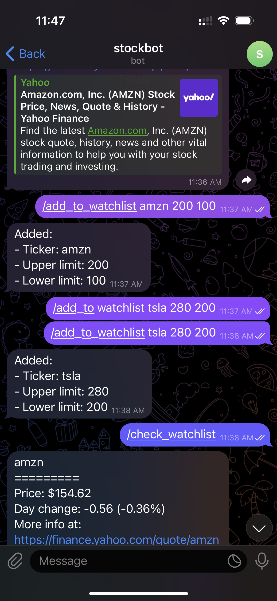

# Stock Alarm Telegram Bot
Open source complete telegram bot gives allows you to add stocks to a watchlist and you can set your own upper and limits and be notified via Telegram whenever a price hits/exceeds a upper/lower limit. Create a telegram bot and before running make sure to set the token in the environment variables. The bot can handle multiple users at simultaneously meaning multiple users on different devices can interact with the bot with no problem.
`export B_TOKEN="BOT TOKEN"`

## Telegram Bot Commands
    • /start - run this FIRST before using other commands
    • /help - help menu
    • /check_watchlist - get the current prices of the stocks in your watchlist
    • /check_price <ticker> - get the price of any stock - usage e.g. (/check_price tsla)        
    • /add_to_watchlist <ticker> <upper limit> <lower limit> - add ticker, upper and lower limit - usage e.g. (/add_to_watchlist tsla 280 210)
    • /remove_from_watchlist <ticker> - remove ticker, upper and lower limit from the watchlist - usage e.g. (/remove_from_watchlist tsla)

## Preview

